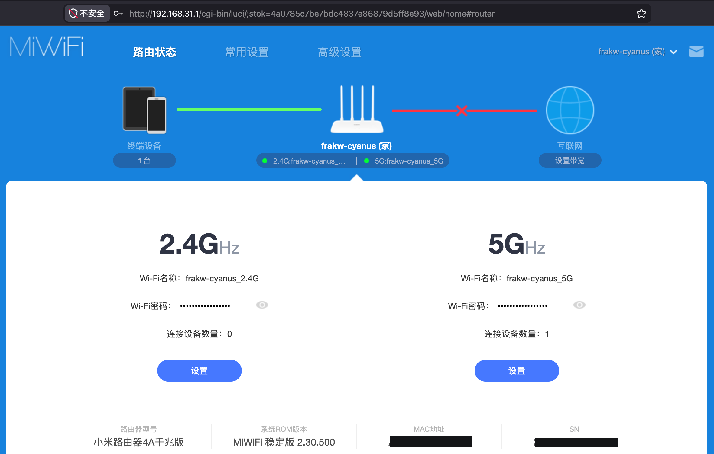
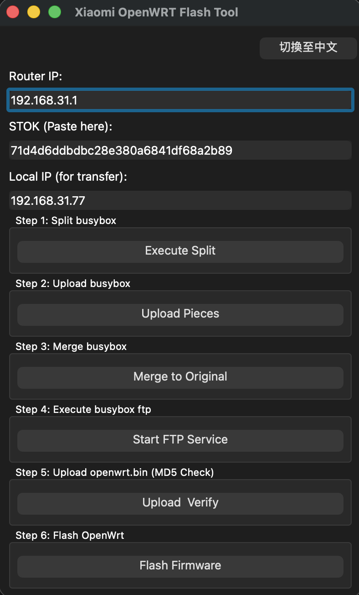
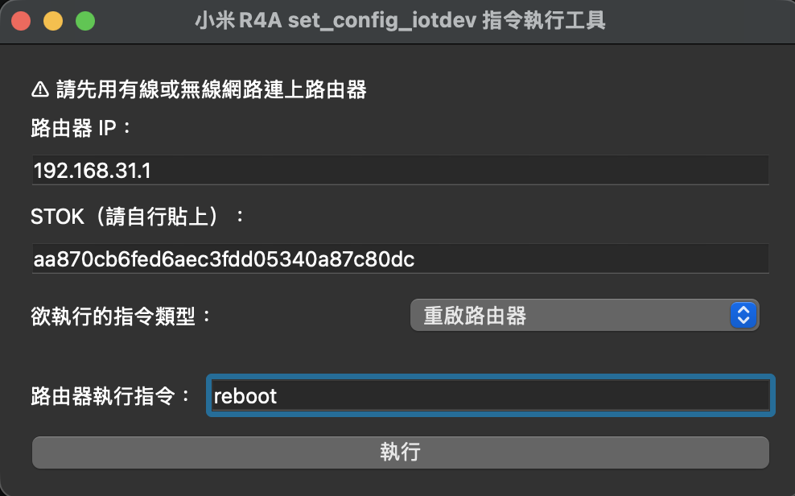
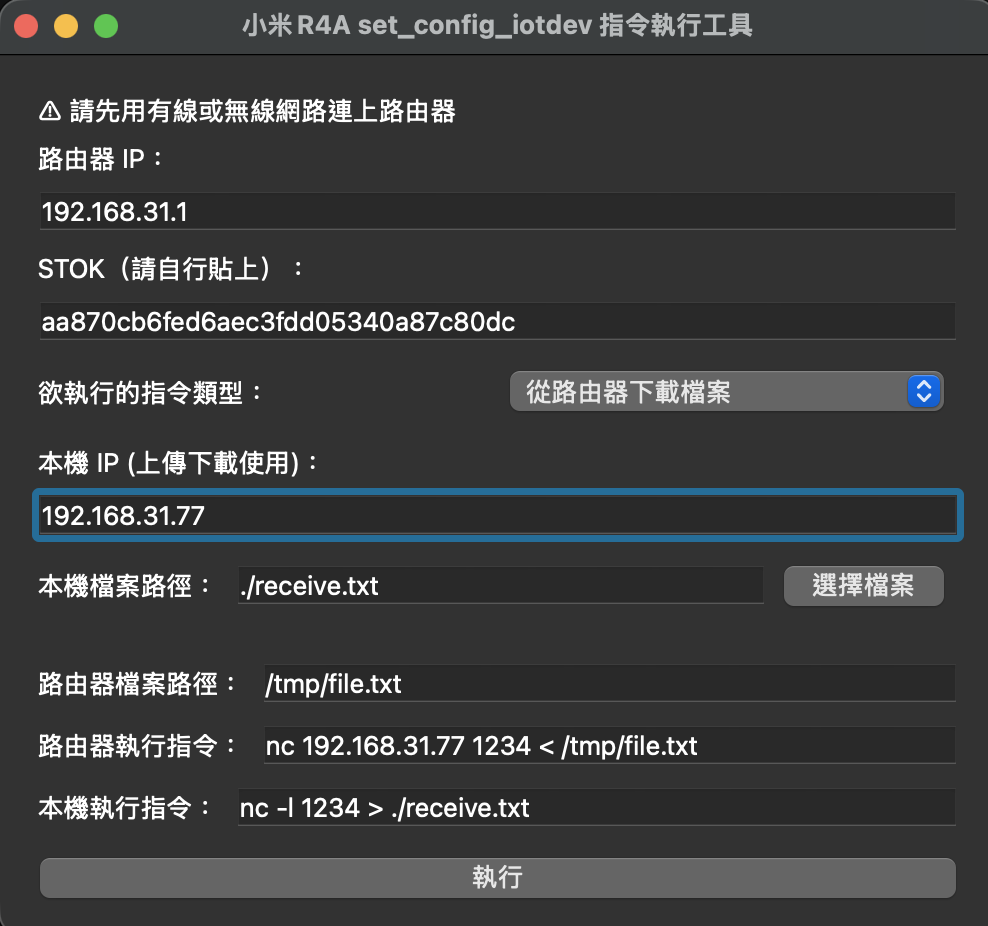
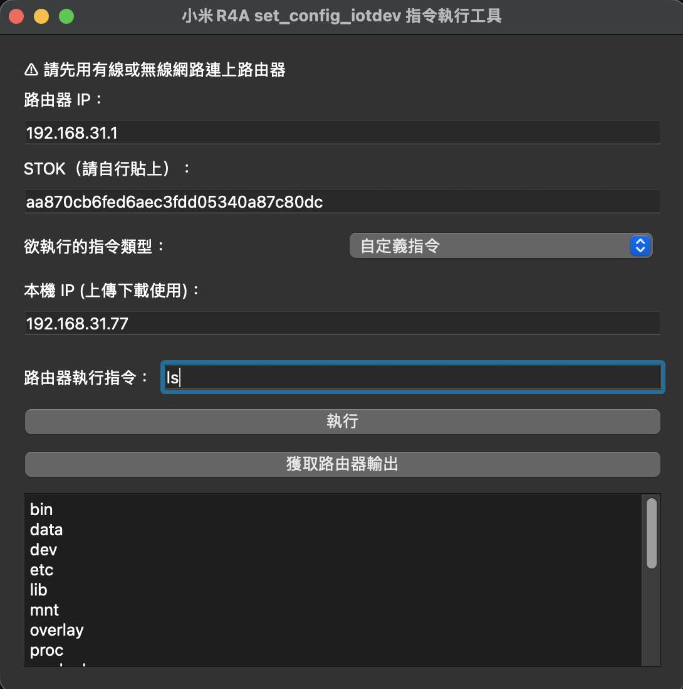

# Xiaomi OpenWRT Flash Tool (R4AGv2)
A simple GUI tool to flash OpenWRT on Xiaomi Router by exploit execution. Especially for R4AGv2.
## Environment
* Device : Xiaomi Mi Router 4A Gigabit v2 (R4AGv2)
* ROM Version : 2.30.500
* CPU : ramips/mt7621
* OpenWRT : 23.05.3
* Linux Kernel : 5.15.150
## Flash Method
This tool facilitates OpenWrt installation on Xiaomi routers by leveraging the `set_config_iotdev` exploit. The method involves splitting **busybox** into small fragments to bypass system command limits, uploading them, and merging them on the device to establish a functional environment. Once this environment is active, the tool uses an **FTP** service to transfer the **OpenWRT** firmware to the router. After integrity checks are performed to ensure safety, the `mtd write` command is executed to complete the flashing process.
## Usage
Setup python environment.
```console
conda create -n xoft python=3.9
```
Activate python environment.
```console
conda activate xoft
#linux:
source activate xoft
```
Install python packages.
```console
pip3 install -r requirements.txt
```
Run openwrt flash tool.
```console
python3 FlashTool.py
```
Follow up the GUI guide to flash.
## GUI
Fill folowing informations:
* Router IP, default is `192.168.31.1`
* STOK, login to router's dashboard and copy from URL

* Local IP, check from router's dashboard or command `ifconfig/ipconfig`

Execute step by step.


After successfully flashing the firmware, access `192.168.1.1` via **wired network**. \
Please note that WiFi is not enabled by default and needs to be switched in the interface settings.
## TestTool
Another GUI tool for testing exploit execution and transferring, also support custom command with display router output.
```console
conda activate xoft
python3 TestTool.py
```
<details span>
<summary>Screenshots</summary>

* Reboot

* Upload file

* Download file

* Custom commands


</details>